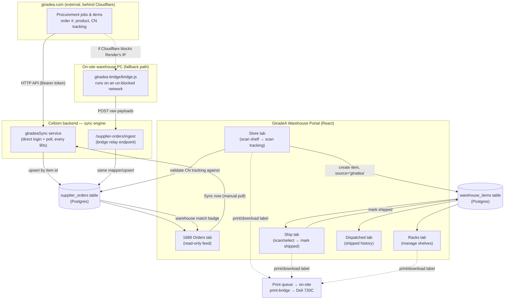

# GtradeA Warehouse Portal — Documentation

This folder documents the **GtradeA** side of the Cellzen warehouse app: the
tracking portal staff use to receive, shelve, and ship 1688 procurement goods
that were ordered through **gtradea.com**.

The app is one React component (`WarehouseApp.jsx`) rendered in two modes:

| Mode | Route | Tabs | Purpose |
|---|---|---|---|
| `cellzen` | `/warehouse` | Store · Ship · Racks · Dashboard · Dispatched | General Cellzen warehouse — any tracking number allowed |
| **`gtradea`** | `/warehouse-gtradea` | Store · Ship · Racks · Dispatched · **1688 Orders** | 1688 procurement goods — tracking numbers are validated against real gtradea orders |

Both modes share the same shelves (racks) and the same physical building; they
are kept as separate tabs/filters (`source: 'cellzen' | 'gtradea'` on every
item) rather than separate apps, so staff can switch between them with one tap
in the header.

This documentation set covers **every panel** of the GtradeA portal, one file
each:

1. [Store panel](./01-store-panel.md) — receive a shipment onto a shelf
2. [Ship panel](./02-ship-panel.md) — find a box and mark it shipped
3. [Racks panel](./03-racks-panel.md) — manage shelves
4. [Dispatched panel](./04-dispatched-panel.md) — shipped-item history
5. [1688 Orders panel](./05-1688-orders-panel.md) — the gtradea order feed
6. [Sync engine & on-site bridge](./06-sync-engine-and-bridge.md) — how orders get from gtradea.com into this app
7. [Shared components](./07-shared-components.md) — scanner, labels/printing, confirm dialogs, auth gate

---

## 1. What problem this solves

Cellzen buys goods through **1688.com** (a Chinese B2B marketplace), and those
purchases are managed on a separate procurement platform, **gtradea.com**.
Once the supplier ships, gtradea records a **CN tracking number** against the
order. Physically, boxes then arrive at the Cellzen warehouse and need to be
shelved, tracked, and eventually shipped out to the end customer.

The GtradeA portal bridges those two worlds:

- It **pulls order + tracking data from gtradea** automatically, so staff
  never have to re-type an order number or tracking number by hand.
- It lets staff **scan a box's tracking number** to receive it — and
  **rejects any tracking number that gtradea doesn't recognize**, which keeps
  garbage out of the warehouse records.
- It shows, at a glance, which gtradea orders have **physically arrived**
  ("📦 Received") and which are still **in transit or not yet updated on
  gtradea** ("⏳ Not Updated" / "Not received").

## 2. The story, step by step

Told as a walkthrough of one order's life, start to finish:

1. **A buyer at Cellzen places a procurement order** on gtradea.com against a
   1688 supplier. gtradea creates a *procurement job*, which contains one or
   more *procurement items* (line items) — each with a product, a quantity,
   and (once the supplier ships) a **china_tracking_no**.

2. **Every 90 seconds** (or sooner, see step 3), the Cellzen backend's
   `gtradeaSync` service quietly logs into gtradea (or refreshes its token),
   lists all procurement jobs, fetches each job's detail, and **upserts one
   row per procurement item** into the Cellzen database's `supplier_orders`
   table — keyed on gtradea's own item id, so re-syncing never creates
   duplicates. See [Sync engine & bridge](./06-sync-engine-and-bridge.md).

   > If gtradea's Cloudflare protection is blocking the Cellzen server's IP,
   > this step instead happens via the **on-site bridge** — a small script
   > running on a warehouse PC that isn't blocked, which fetches the same data
   > and relays it to the same upsert logic over a signed POST request. The
   > rest of the story is identical either way.

3. **A staff member opens the "1688 Orders" tab.** The moment that tab opens,
   the browser (a) loads whatever is already cached in the database and (b)
   fires an on-demand "sync now" request so the list is fresh, not
   minutes-old. Every order shows its product photo, order number, quantity,
   CN tracking number, and a pill: **⏳ Not Updated** (gtradea has no tracking
   yet), **Not received** (tracking exists, box hasn't been scanned in), or
   **📦 Received · CZNxxxxx** (the box is physically on a shelf). See the
   [1688 Orders panel](./05-1688-orders-panel.md).

4. **The box physically arrives** at the warehouse. A staff member opens the
   **Store** tab, scans (or types) the shelf label first (e.g.
   `CZN01-01-0001`), then scans the box's CN tracking number.
   - The backend checks that tracking number against `supplier_orders`. If
     gtradea has never heard of it, the scan is **rejected** ("This tracking
     number doesn't exist in the orders") — this is what keeps 1688 stock
     honest.
   - If it matches, the backend **mints an internal code** (`CZN-00001`,
     `CZN-00002`, …) — or reuses one, if another box from the same 1688 order
     number already has one — links the item to the matched order number +
     product name, and stores it as `in_stock` on that shelf.
   - The 1688 Orders panel now shows that order as **📦 Received**, because
     its tracking number matches a stored item.
   See the [Store panel](./01-store-panel.md).

5. **The item sits on the shelf** until it's ready to go out. A staff member
   can browse **Racks** to see which shelves exist and print/download a shelf
   barcode label, or look the item up any time via **Ship** (search by code,
   tracking number, or shelf). See the
   [Racks panel](./03-racks-panel.md).

6. **The item ships to the customer.** On the **Ship** tab, staff scan the
   box (or select it and tap the checkmark). Because this is the GtradeA
   section, shipping needs only one confirmation tap — no carrier/land-sea
   details are collected here (that's a Cellzen-only requirement). The item's
   status flips to `shipped`, stamped with who shipped it and when. See the
   [Ship panel](./02-ship-panel.md).

7. **The shipped record lives on in Dispatched** as a permanent log of what
   left the warehouse and when, until someone explicitly deletes it (e.g. to
   clear test data). See the [Dispatched panel](./04-dispatched-panel.md).

Throughout, any panel can **print a label** (sent to the on-site Deli 720C
printer via a queue) or **download one as PNG**; see
[Shared components](./07-shared-components.md).

## 3. System flowchart

## 4. The two "shapes" of data, and why they're separate tables

- **`supplier_orders`** — a mirror of what gtradea knows: order number, CN
  tracking, product, quantity, status. Read-only from the app's point of
  view; only the sync engine writes to it. One row per **procurement item**
  (a single gtradea order can have several).
- **`warehouse_items`** — what Cellzen physically has: an internal code
  (`CZNxxxxx`), a shelf, a status (`in_stock` / `shipped`), and (for GtradeA
  items only) a denormalized `order_number` + `product_name` copied from the
  matched supplier order at put-away time.

They're joined **only by tracking number** (`china_tracking_no` ↔
`tracking_number`, both trimmed + uppercased), computed on read — there is no
foreign key between them. This keeps the sync engine simple (it never needs
to know about warehouse state) and keeps the warehouse simple (it never needs
to re-derive gtradea's schema).

## 5. Who can use it

Every route is gated by `authenticate` + a `requireStaffOrAdmin` check
(`role` is `staff`, `admin`, `superadmin`, or `accountType === 'Admin'`).
There is **no per-user data scoping** — every staff member sees the same
shelves, the same items, and the same 1688 orders. The `created_by_*` /
`shipped_by_*` fields exist purely for an audit trail, not for filtering.

Two special, non-human callers also authenticate, each with its own shared
secret (not a staff login):
- The **on-site gtradea bridge** (`GTRADEA_BRIDGE_TOKEN`) — posts to
  `/supplier-orders/ingest`.
- The **on-site print agent** (`PRINT_AGENT_TOKEN`) — polls
  `/warehouse/print-jobs/pending` and reports back completion.
